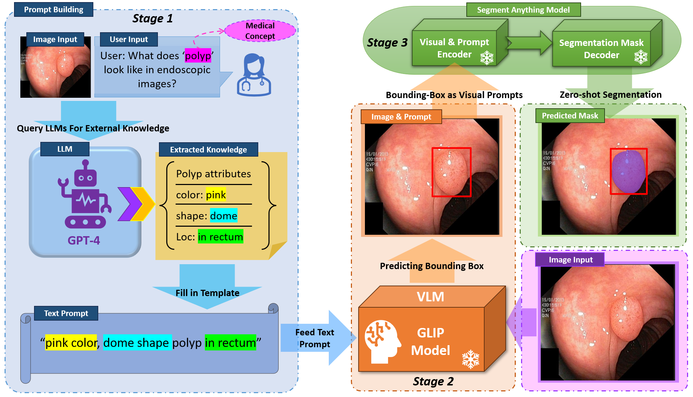
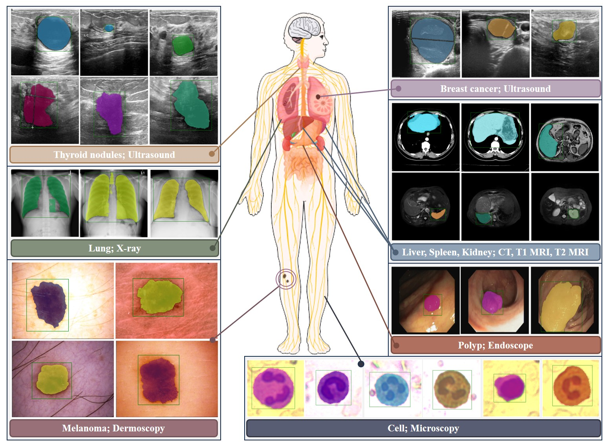
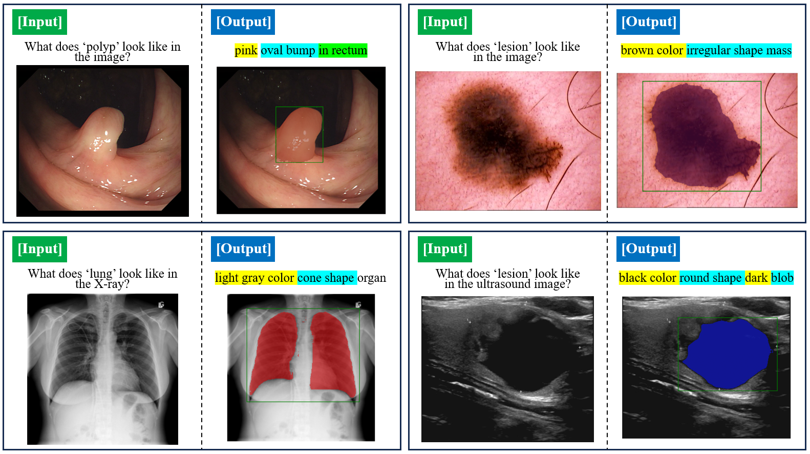

# TV-SAM
Text-Visual-Prompt SAM (TV-SAM) is a novel multimodal medical image zero-shot segmentation algorithm, which incorporates and integrates LLM, VLM, and SAM, to autonomously generate descriptive text prompts and visual bounding box prompts from medical images, thereby enhancing SAM for zero-shot segmentation.

You can follow the work at: https://arxiv.org/abs/2402.15759?context=cs.CV

The TV-SAM algorithm workflow:

TV-SAM can be used for multimodal medical image zero-shot segmentation:

The TV-SAM inference examples:

We have developed and built a web tool for multimodal medical image segmentation, and the TV-SAM algorithm will be embedded into it. The URL for our segmentation platform will be provided later, and the related code will not be open-sourced at this point. Thank you for your attention.
